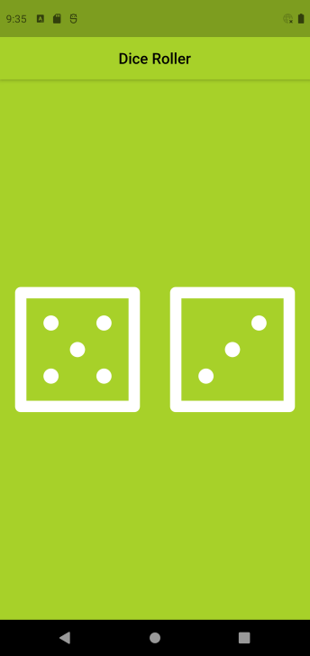

# Dice Roller

A simple dice roller mobile app to explore the features of stateful widget in Flutter.  

The app will randomize the dice faces if any dice is clicked/ pressed.  

## Example  

### Before

### After  

  
